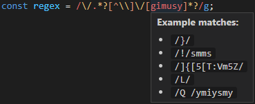

# Inlay Regex

A [VSCode](https://github.com/microsoft/vscode) extension which generates sample regular expressions for display in a hover text box to help you understand those complex patterns.

## Example

## Installation

This extension is available in the [VSCode Marketplace](https://marketplace.visualstudio.com/items/Nixinova.inlay-regex).
For manual install see attachments in the [releases tab](https://github.com/Nixinova/Inlay-Regex/releases).

## Usage

Simply hover over a regular expression literal in one of the following supported languages to be shown up to five possible matches.

### Supported languages
- JavaScript / JSX
- TypeScript / TSX
- CoffeeScript
- Ruby
- Groovy
